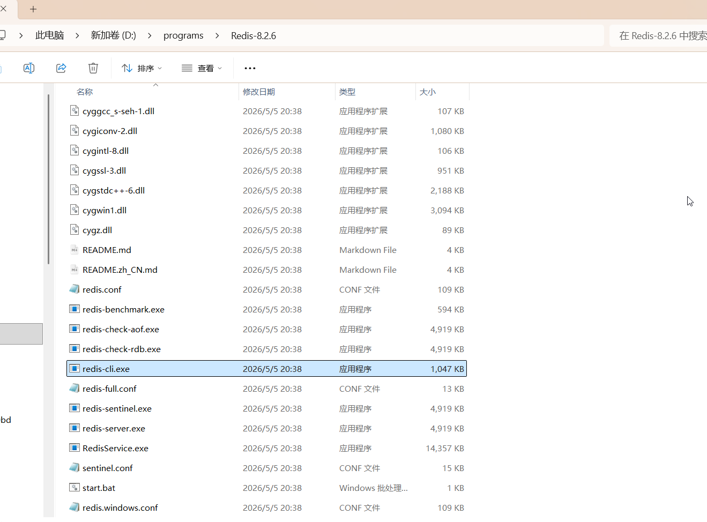
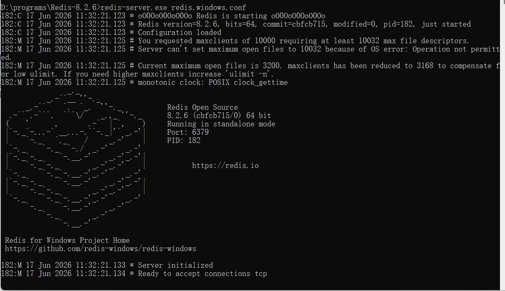
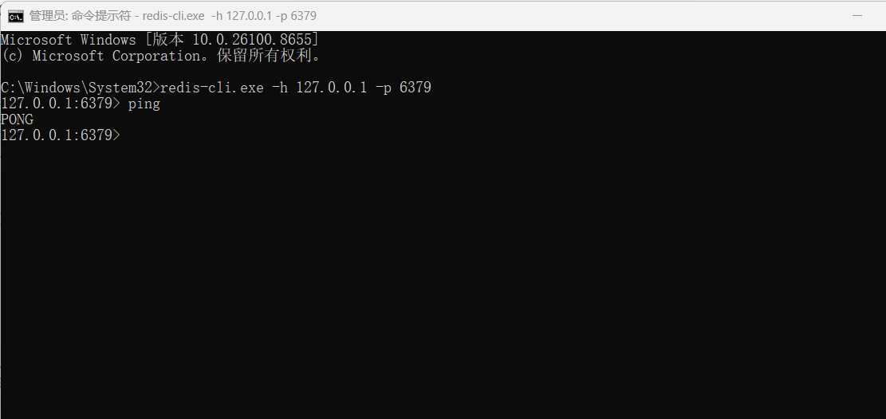
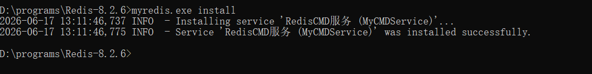
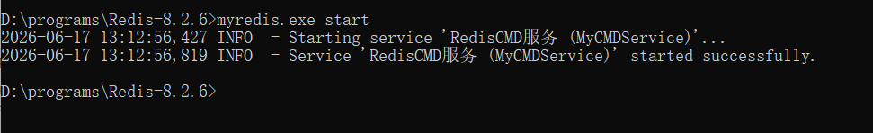
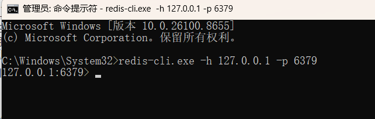
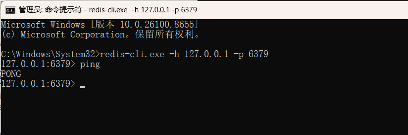
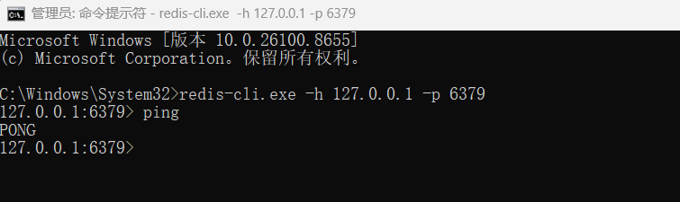

## 1.下载：https://github.com/redis-windows/redis-windows/releases/download/8.2.6/Redis-8.2.6-Windows-x64-cygwin-with-Service.zip


## 2.然后把他解压缩把文件夹改名Redis-8.2.6，并且放到d:\programs文件夹下面



## 3.启动服务器

### 以管理员身份打开一个cmd窗口，转到Redis-8.2.6里面，运行：redis-server.exe redis.windows.conf，如果没有意外，服务器就启动了



## 4.以管理员身份打开一个cmd窗口，输入：redis-cli.exe -h 127.0.0.1 -p 6379，如果没有意外，就能够连接服务器，你输入ping 服务器会返回pong



## 5.把redis安装为服务，使用下面的命令：

#### redis-server --service-install redis.windows.conf --loglevel verbose，

## ！！！注意3.2.1以上的redis无法直接在windows上面安装为服务

## 6.我们尝试在redis8.2.6文件夹里面创建一个redis-service.cmd脚本文件，内容如下

```
redis-server.exe redis.windows.conf
```

## 7.我们下载一个scripter wrapper把它包装为一个服务，网址：https://github.com/winsw/winsw/releases

## 8.把cmd文件安装为服务

### 8.1将下载的 `WinSW.exe` 放在与你的 `.cmd` 脚本相同的目录下。然后改名myredis.exe并在同级目录创建一个同名的 `XML` 配置文件（例如：如果你的工具叫 `myscript.exe`，则创建 `myscript.xml`）。这里是myredis.xml，容纳如下

```
<service>
    <id>MyCMDService</id>
    <name>RedisCMD服务</name>
    <description>这是一个通过 WinSW 运行的 CMD 脚本redis服务</description>
    <!-- 执行文件指向 cmd.exe -->
    <executable>cmd.exe</executable>
    <!-- 传入参数，/c 表示运行后关闭窗口，后面跟你的实际脚本路径 -->
    <arguments>/c "D:\programs\Redis-8.2.6\redis-service.cmd"</arguments>
    <logmode>append</logmode>
</service>
```

## 9.打开 Windows **命令提示符（CMD）**（需以管理员身份运行），切换到服务所在目录，使用以下命令进行操作： [[1](https://blog.3vyd.com/blog/posts-output/2024-09-07-winsw-windows-service/), [2](https://www.anye.xyz/archives/fbhvX7JI)]

- **安装服务**：`myredis.exe install`

  

- **启动服务**：`myredis.exe start`

  

- **停止服务**：`myredis.exe stop`

- **卸载（删除）服务**：`myredis.exe uninstall`

- **查看服务状态**：`myredis.exe status`

## 10 测试redis服务，用管理员权限打开一个cmd窗口，然后输入：redis-cli.exe -h 127.0.0.1 -p 6379，如果没有意外，就会打开下面的命令提示符，说明服务是正常运行的。



### 此时你输入ping，服务器会返回pong



## 11.我们我们重启电脑看看服务是否自动启动，发现可以




