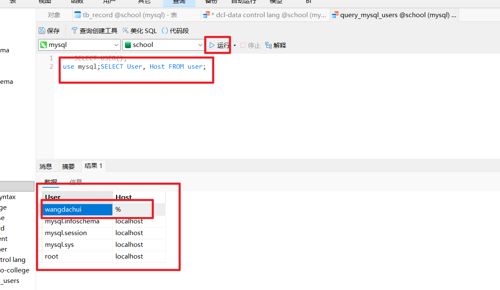

## SQL详解之DCL

数据库服务器通常包含了非常重要的数据，可以通过访问控制来确保这些数据的安全，而 DCL 就是解决这一问题的，它可以为指定的用户授予访问权限或者从指定用户处召回指定的权限。DCL 对数据库管理员来说非常重要，因为用户权限的管理关系到数据库的安全。简单的说，我们可以通过 DCL 允许受信任的用户访问数据库，阻止不受信任的用户访问数据库，同时还可以通过 DCL 将每个访问者的的权限最小化（让访问者的权限刚刚够用）。

### 查看mysql数据库有哪些用户

```
use mysql;
SELECT User, Host FROM user;
```

### python代码：pymysql,这个查询的数据库名称必须是mysql，她后面的语句可以不是mysql

```
import pymysql

conn = None

#查看数据库的所有用户
def get_all_user(conn):
    if conn == None:
        conn = pymysql.connect(host='127.0.0.1', port=3306,
                        user=youruser, password=yourpassword,
                        database='mysql', charset='utf8mb4') # 查看用户的时候，数据库名称必须是mysql
    cursor = conn.cursor()
    res = cursor.execute("SELECT User, Host FROM user;")
    print(res)  # 当前有4个用户
    for row in cursor.fetchall():
        print(row)
    conn.close 

```


### 创建用户

我们可以使用下面的 SQL 来创建一个用户并为其指定访问口令。

```SQL
CREATE USER 'wangdachui'@'%' IDENTIFIED BY 'Wang.618';
```

python代码：pymysql

```
import pymysql

conn = None

def add_user(conn,params): #新增用户
    if conn == None:
        conn = pymysql.connect(host='127.0.0.1', port=3306,
                        user='root', password='root',
                        database='school', charset='utf8mb4')
    cursor = conn.cursor()
    res = cursor.execute("CREATE USER %s@%s IDENTIFIED BY %s;",(params[0],params[1],params[2]))
    print(res)
    conn.commit()  
    conn.close 

if __name__ == '__main__':
    add_user(conn,('wangdachui','%','Wang.618'))
    
```

#### 效果



上面的 SQL 创建了名为 wangdachui 的用户，它的访问口令是 Wang.618，该用户可以从任意主机访问数据库服务器，因为 @ 后面使用了可以表示任意多个字符的通配符 %。如果要限制 wangdachui 这个用户只能从 192.168.1.x 这个网段的主机访问数据库服务器，可以按照下面的方式来修改 SQL 语句。

```SQL

```


此时，如果我们使用 wangdachui 这个账号访问数据库服务器，我们几乎不能做任何操作，因为该账号没有任何操作权限。

### 授予权限，我们使用'wangdachui'@'%';因为方便一点

我们用下面的语句为 wangdachui 授予查询 school 数据库学院表（`tb_college`）的权限。

```SQL
GRANT SELECT ON `school`.`tb_college` TO 'wangdachui'@'%';
```

### python代码：pymysql

```
import pymysql

conn = None

# 授予权限
def grant_privileges(conn,params): 
    if conn == None:
        conn = pymysql.connect(host='127.0.0.1', port=3306,
                        user='root', password='root',
                        database='school', charset='utf8mb4')
    cursor = conn.cursor()
    # res = cursor.execute("GRANT SELECT ON school.tb_college TO %s@%s;",(params[0],params[1]))
    res = cursor.execute("GRANT SELECT ON school.tb_college TO %s@%s;",params)
    print(res)
    # 刷新权限使其生效
    cursor.execute("FLUSH PRIVILEGES;")
    conn.commit()  
    conn.close 
if __name__ == '__main__':
    grant_privileges(conn,('wangdachui','%'))
    
```


我们也可以让 wangdachui 对 school 数据库的所有对象都具有查询权限，代码如下所示。

```SQL
GRANT SELECT ON `school`.* TO 'wangdachui'@'%';
```

### python代码：pymysql

```
import pymysql

conn = None

def grant_privileges2(conn,params):
    if conn == None:
        conn = pymysql.connect(host='127.0.0.1', port=3306,
                        user='root', password='root',
                        database='school', charset='utf8mb4')
    cursor = conn.cursor()
    # res = cursor.execute("GRANT SELECT ON %s.* TO %s@%s;",params)
    sql = f"GRANT SELECT ON {params[0]}.* TO '{params[1]}'@'{params[2]}';"
    # print(sql)
    res = cursor.execute(sql)
    print(res)
    # 刷新权限使其生效
    cursor.execute("FLUSH PRIVILEGES;")
    conn.commit()  
    conn.close 

if __name__ == '__main__':
   grant_privileges2(conn,('school','wangdachui','%'))
```


如果我们希望 wangdachui 还有 insert、delete 和 update 权限，可以使用下面的方式进行操作。

```SQL
GRANT INSERT, DELETE, UPDATE ON `school`.* TO 'wangdachui'@'%';
```

如果我们还想授予 wangdachui 执行 DDL 的权限，可以使用如下所示的 SQL。

```SQL
GRANT CREATE, DROP, ALTER ON `school`.* TO 'wangdachui'@'%';
```

如果我们希望 wangdachui 账号对所有数据库的所有对象都具备所有的操作权限，可以执行如下所示的操作，但是一般情况下，我们不会这样做，因为我们之前说过，权限刚刚够用就行，一个普通的账号不应该拥有这么大的权限。

```SQL
GRANT ALL PRIVILEGES ON *.* TO 'wangdachui'@'%';
```

### 召回权限

如果要召回 wangdachui 对 school 数据库的 insert、delete 和 update 权限，可以使用下面的操作。

```SQL
REVOKE INSERT, DELETE, UPDATE ON `school`.* FROM 'wangdachui'@'%';
```

如果要召回所有的权限，可以按照如下所示的方式进行操作。

```SQL
REVOKE ALL PRIVILEGES ON *.* FROM 'wangdachui'@'%';
```

需要说明的是，由于数据库可能会缓存用户的权限，可以在授予或召回权限后执行下面的语句使新的权限即时生效。

```SQL
FLUSH PRIVILEGES;
```

