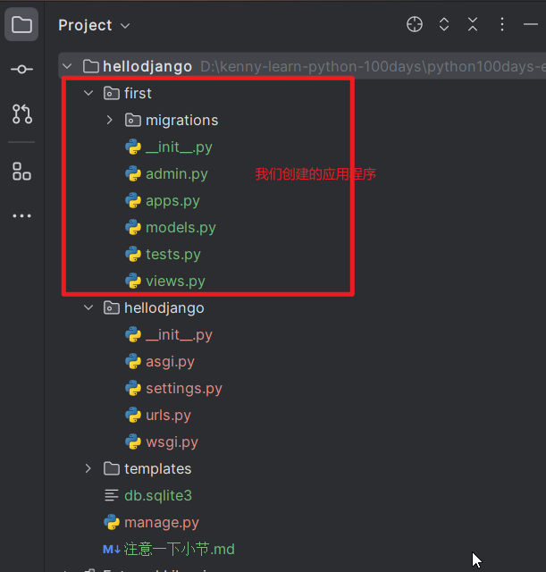
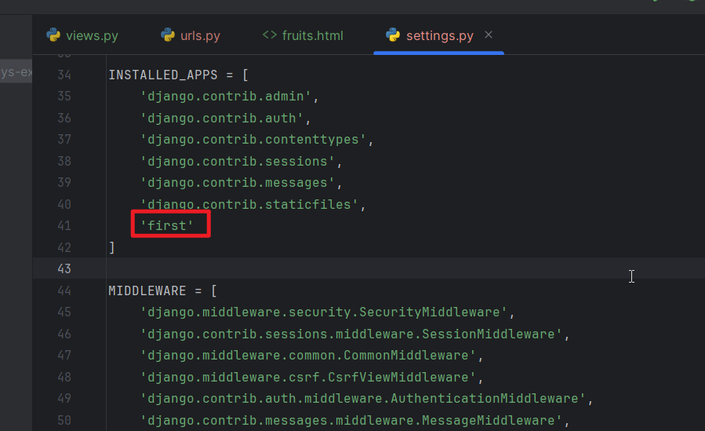
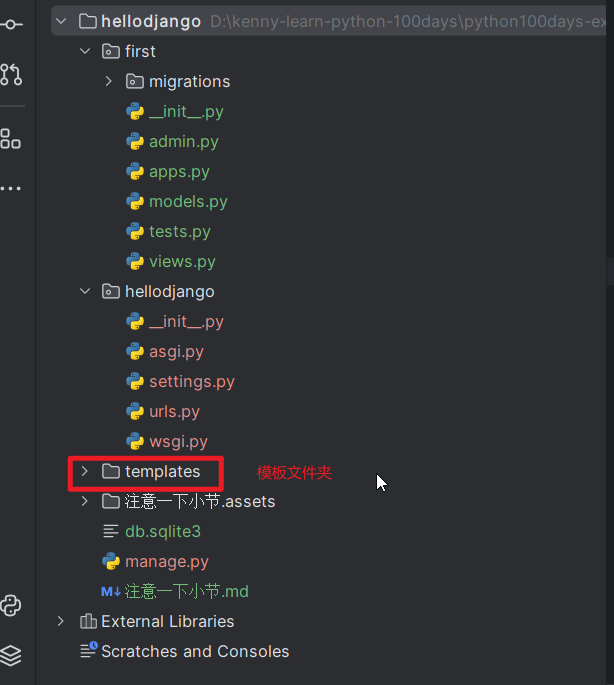
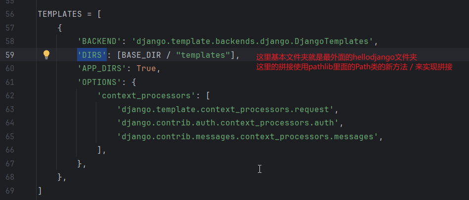
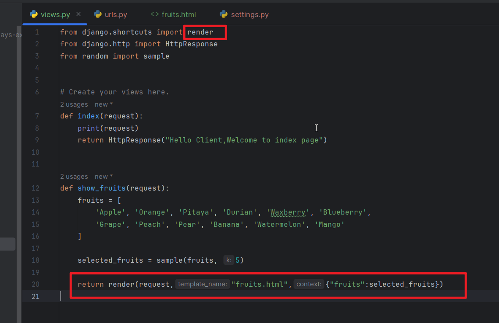

## 1.使用命令django-admin startproject hellodjango创建应该项目，在项目文件夹里面也有一个同名的文件夹，里面的就是项目需要的最基本文件，比如网关文件，理解映射文件，视图函数文件等等，此时项目是可以启动的，命令就是python manage.py runserver但是这里只有django默认生成的路由。这个是不能够满足我们的需求的。我们需要在项目的根目录下面打开一个终端，输入python manage.py startapp first来创建一个应用程序。这个应用程序里面的文件名称和项目他们文件夹的文件名称基本一样，多了一个model.py和一个tests.py，但是这里只是我们这个应用的文件。还会有一个migration文件夹，用于数据迁移。



## 2.创建这个app后，你需要在项目同名文件夹里面的settings的INSTALLED_APPS列表里面注册我们的first应用程序



## 3.然后我们可以使用html模板结合render函数来高效渲染页面，这个模板里面可以使用一些占位符，然后我们用我们的数据来替代他们，如果需要使用模板，需要在项目的根目录下面创建一个templates（其实也可以在别的位置，但是需要配置）



## 4.需要在settings里面的TEMPLATES列表里面的'DIRS'选项里面配置我们的templates文件夹的相对路径，我们是在基本文件夹下面的templates文件夹里面



## 5.我们的fruits.html的模板文件的内容如下

```
<!DOCTYPE html>
<html lang="en">
    <head>
        <meta charset="UTF-8">
        <title>首页</title>
        <style>
            #fruits {
                font-size: 1.25em;
            }
        </style>
    </head>
    <body>
        <h1>今天推荐的水果是：</h1>
        <hr>
        <ul id="fruits">
            
            <li>{{ fruit }}</li>
            
        </ul>
    </body>
</html>
```

## 6.我们在first应用程序里面的view.py里面使用这个模板文件，给他传递我们随机选择的水果作为数据

