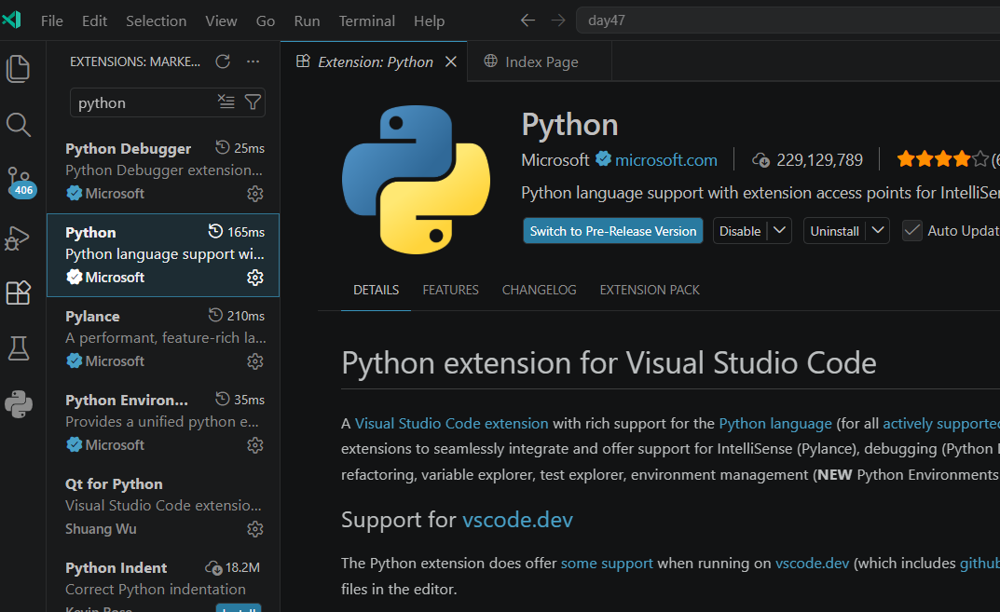
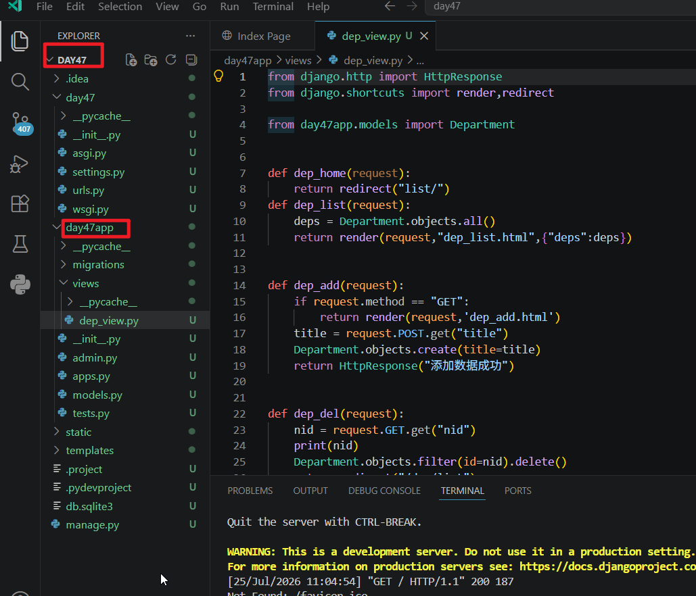
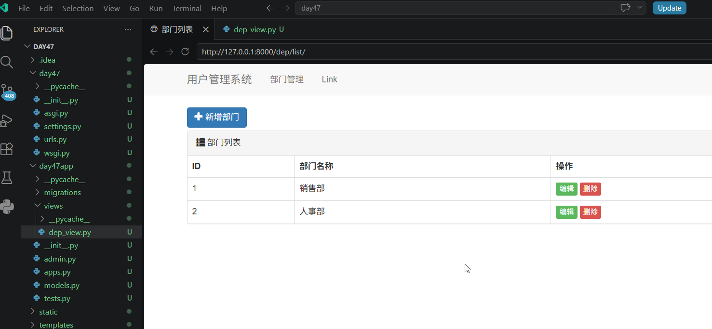
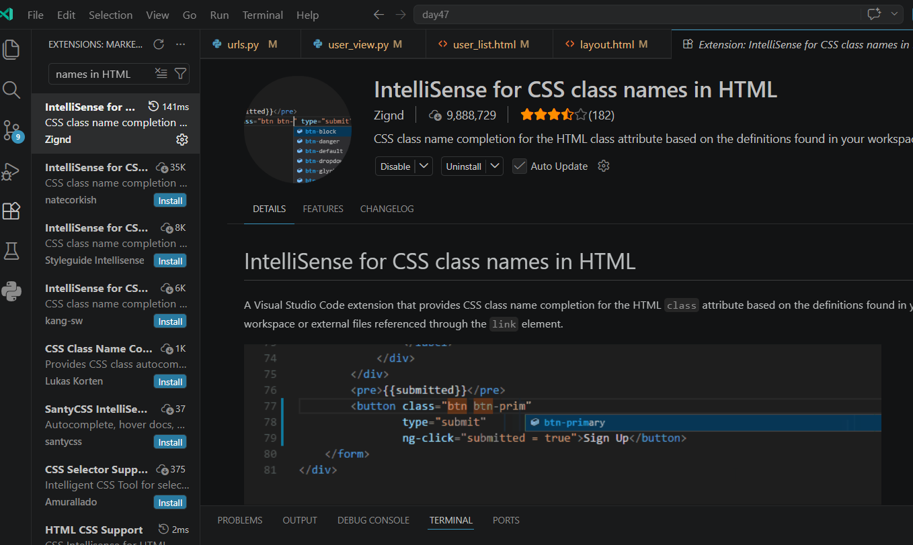
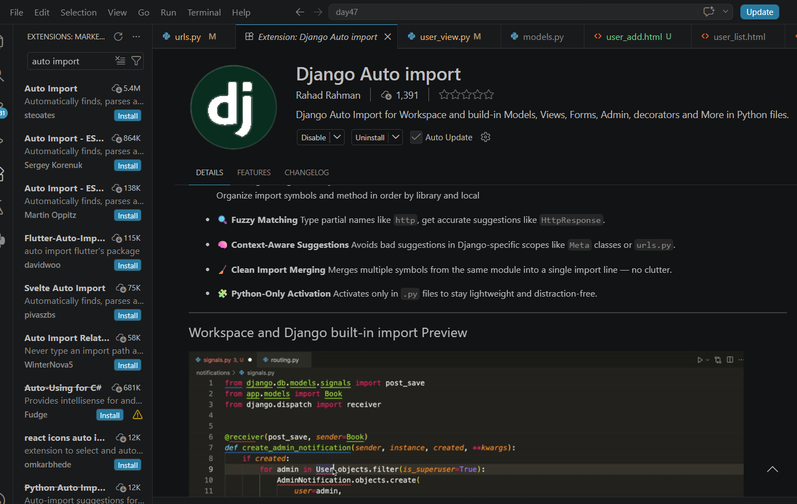
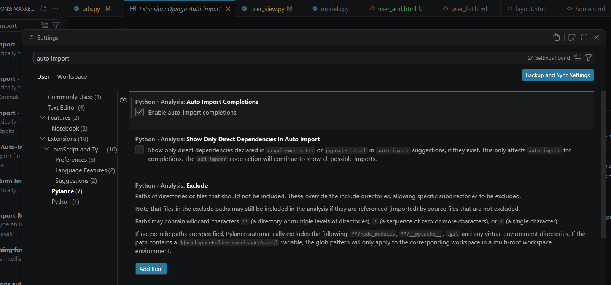

# 1.前提，安装python环境和django库，这里使用5.0版本

# 2.安装python和django环境

## 1.安装好vscode后，先安装python插件，使用Microsoft的就好

## 2.安装django插件和django-template插件

## 3.用< django-admin startproject 项目名称 >来创建项目，然后用vscode打开，这里我们创建了一个day47项目，然后需要使用< python manage.py startapp app 应用程序名称> 来创建一个app这里我们创建了day47app

## 运行项目，打开一个终端，定位到项目根目录，输入： python manage.py runserver，可以在vscode里面看到运行结果

### 其实，也挺方便的哟

# 3.解决安装了上述环境后emmet插件不工作的问题

Django 的模板文件（如 `.html`）和 VS Code 的 Emmet 插件在默认情况下**会产生冲突**。当你在 Django 模板中使用 `` 或 `{{ }}` 语法时，Emmet 可能会拦截或错误解析部分 HTML 属性与快捷键，导致无法正常弹出自动补全。 [[1](https://www.reddit.com/r/djangolearning/comments/nq47tc/help_wanted_vscodes_emmet_plugin_messing_up_my/?tl=zh-hant), [2](https://www.volcengine.com/article/1560529), [3](https://www.volcengine.com/article/1568896)]

解决冲突的方法

- **开启语言关联**：打开 VS Code 的 `settings.json` 设置，添加 `emmet.includeLanguages` 配置，把 Django 模板语言（如 `django-html`）和 `html` 关联起来。
- **修改配置文件**：在设置中加入 `"emmet.includeLanguages": {"django-html": "html"}`，让 Emmet 在编写 Django 页面时能正确识别标签

# 4.解决vscode编写bootstrap没有提示

VSCode进行Bootstrap开发没有提示通常是因为缺少类名补全插件或未正确引入CSS文件。请安装 **[⁠IntelliSense for CSS class names in HTML](https://marketplace.visualstudio.com/items?itemName=Zignd.html-css-class-completion)** 插件并确保引入了Bootstrap样式。

解决步骤

- 安装 **IntelliSense for CSS class names in HTML** 插件来自动补全class类名。

  

# 5 .配置vscode调用函数时自动添加小括号

针对 JavaScript / TypeScript

打开 VS Code 的 `settings.json` 配置文件，或者在设置面板中搜索并勾选以下选项： [[1](https://github.com/sveltejs/language-tools/issues/2120), [2](https://www.cnblogs.com/ixtao/p/18510018)]

- `"js.suggest.completeFunctionCalls": true`
- `"ts.suggest.completeFunctionCalls": true` [[1](https://github.com/sveltejs/language-tools/issues/2120)]

针对 Python (Pylance 语言服务器)

打开 `settings.json` 配置文件，确保使用 Pylance 并加入以下配置： [[1](https://forum.cursor.com/t/support-for-python-analysis-completefunctionparens/135802), [2](https://blog.csdn.net/weixin_44321570/article/details/122515280)]

- `"python.analysis.completeFunctionParens": true` [[1](https://blog.csdn.net/weixin_44321570/article/details/122515280)]

# 6.配置vscode自动导入python库

## 1.安装Django auto import

## 2.在 VS Code 中配置 Python 自动导入库，核心是通过安装官方的 **Pylance** 插件并开启自动补全导入选项来完成。 [[1](https://blog.csdn.net/m0_66842854/article/details/136559623)]

配置步骤

- **安装插件**：确保在扩展商店中安装了微软官方的 **Python** 和 **Pylance** 插件。
- **打开设置**：按下快捷键 `Ctrl + ,`（Windows）或 `Cmd + ,`（Mac）打开设置页面。
- **搜索配置**：在顶部的搜索框中输入 `auto import`。
- **勾选选项**：找到 **Python > Analysis: Auto Import Completions** 并确保将其**勾选**（开启状态）。 [[1](https://blog.csdn.net/m0_59119402/article/details/143733700), [2](https://zhuanlan.zhihu.com/p/1904849575388361435), [3](https://blog.csdn.net/m0_66842854/article/details/136559623)]

使用方法

配置完成后，当你在代码中直接输入某个库的函数或类名（例如 `os` 或 `np`），在弹出的代码补全列表中按下回车或 `Tab` 键，VS Code 就会自动在文件顶部插入对应的 `import` 语句。 [[1](https://zhuanlan.zhihu.com/p/345806901)]

